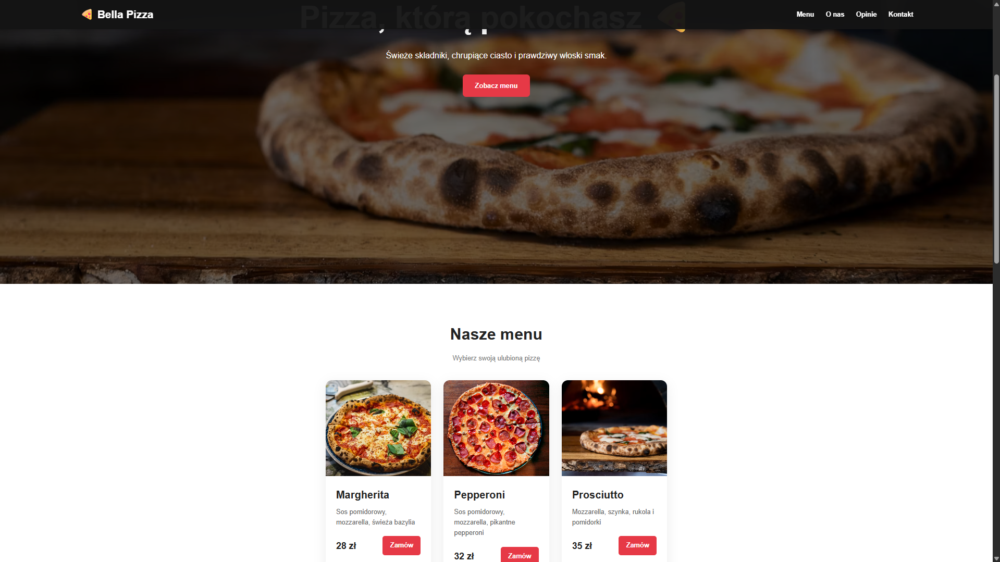

# Bella Pizza

Responsywna strona internetowa fikcyjnej włoskiej pizzerii, stworzona jako projekt portfolio.

## Live demo

### [→ Zobacz stronę na żywo](https://bella-pizza-dopu.onrender.com)

> Serwis jest hostowany na Render, dlatego pierwsze uruchomienie może potrwać chwilę.



## O projekcie

Bella Pizza to kompletna strona restauracji z responsywnym interfejsem oraz działającym formularzem kontaktowym.

Projekt obejmuje zarówno frontend, jak i prosty backend odpowiedzialny za obsługę wiadomości z formularza.

## Funkcje

- responsywny layout na telefon, tablet i komputer
- mobilne menu
- animacje elementów podczas przewijania
- formularz kontaktowy
- walidacja danych po stronie serwera
- ograniczenie liczby wysyłanych wiadomości
- wysyłanie wiadomości e-mail przez API
- komunikaty o powodzeniu i błędach formularza
- podstawowe SEO
- publiczny deployment

## Technologie

**Frontend**

HTML5 · CSS3 · JavaScript

**Backend**

Node.js · Express.js

**Pozostałe**

Resend API · express-rate-limit · Git · GitHub · Render

## Jak działa formularz?

Po wysłaniu formularza dane trafiają do endpointu Express:

```text
POST /api/contact
```

Serwer sprawdza poprawność danych oraz limit wysyłanych wiadomości, a następnie wykorzystuje Resend API do dostarczenia wiadomości e-mail.

Klucze API i pozostałe prywatne dane są przechowywane w zmiennych środowiskowych i nie znajdują się w repozytorium.

## Uruchomienie lokalne

Wymagany jest Node.js.

```bash
npm install
npm start
```

Następnie otwórz:

```text
http://localhost:3000
```

Do działania wysyłania wiadomości wymagane są również zmienne środowiskowe:

```env
RESEND_API_KEY=your_resend_api_key
CONTACT_EMAIL=your_email@example.com
```

Bez nich nadal można uruchomić i obejrzeć frontend projektu.

## Struktura projektu

```text
bella-pizza/
├── public/
│   ├── index.html
│   ├── style.css
│   ├── script.js
│   └── favicon.svg
├── assets/
│   └── preview.png
├── server.js
├── package.json
├── package-lock.json
├── .gitignore
└── README.md
```

## Informacja

Bella Pizza jest fikcyjną restauracją stworzoną jako projekt demonstracyjny do portfolio.
